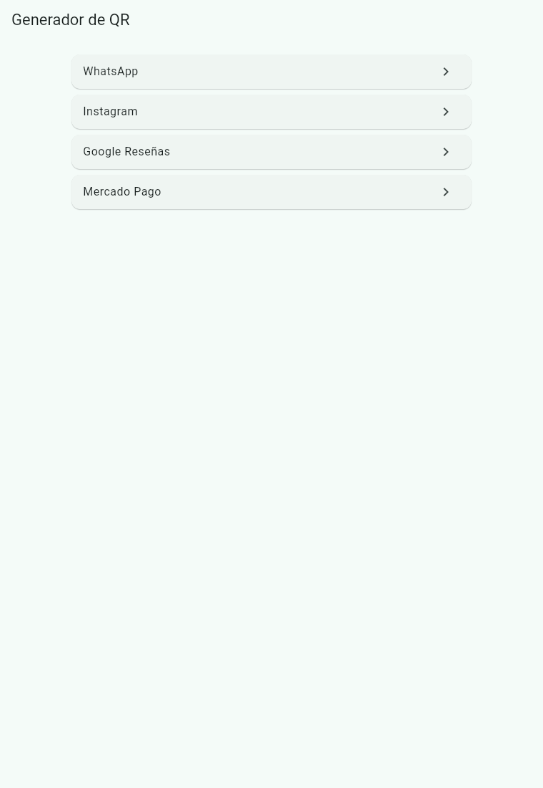
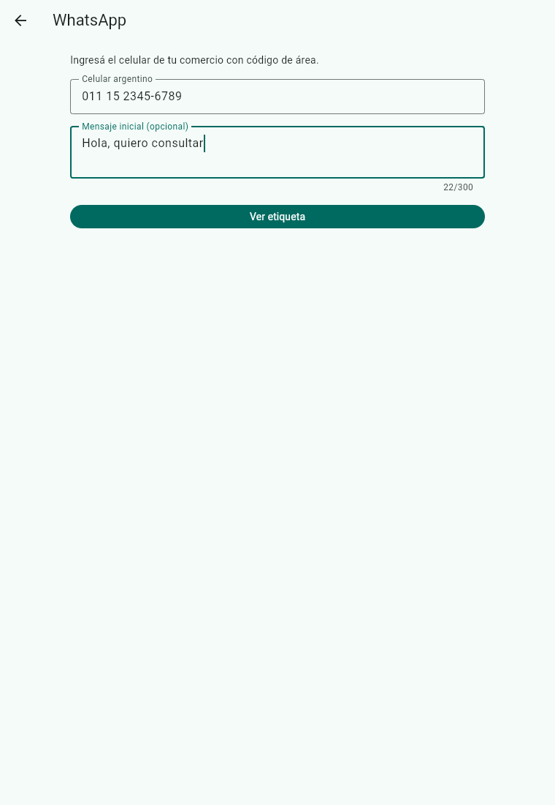
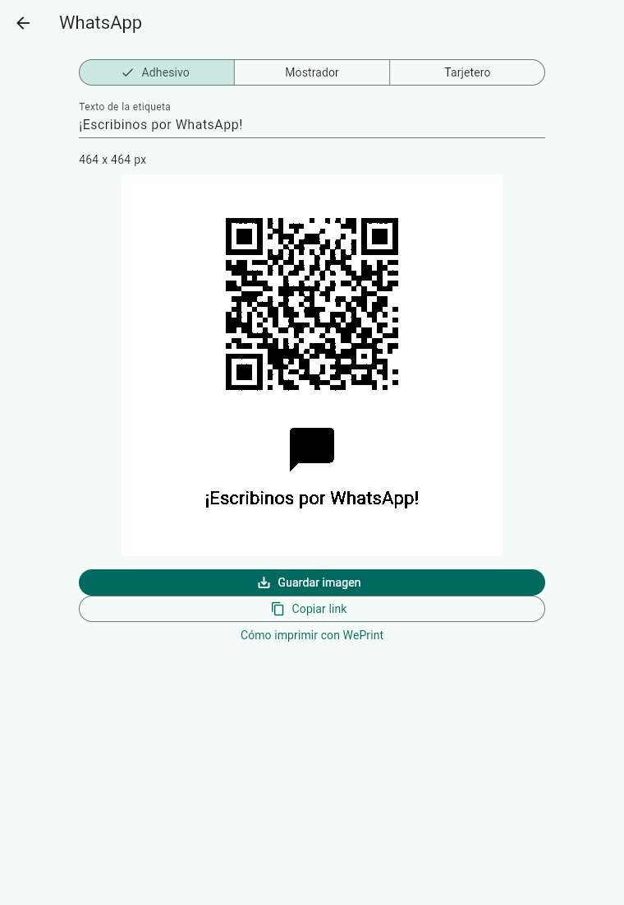
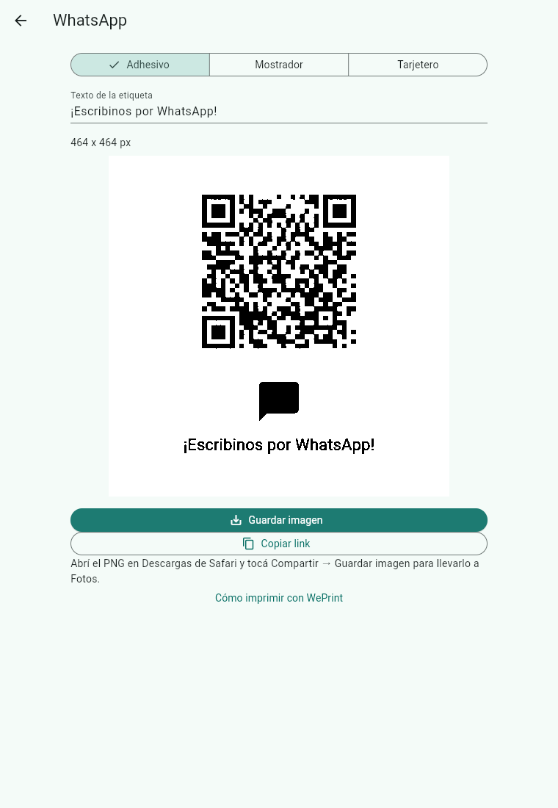
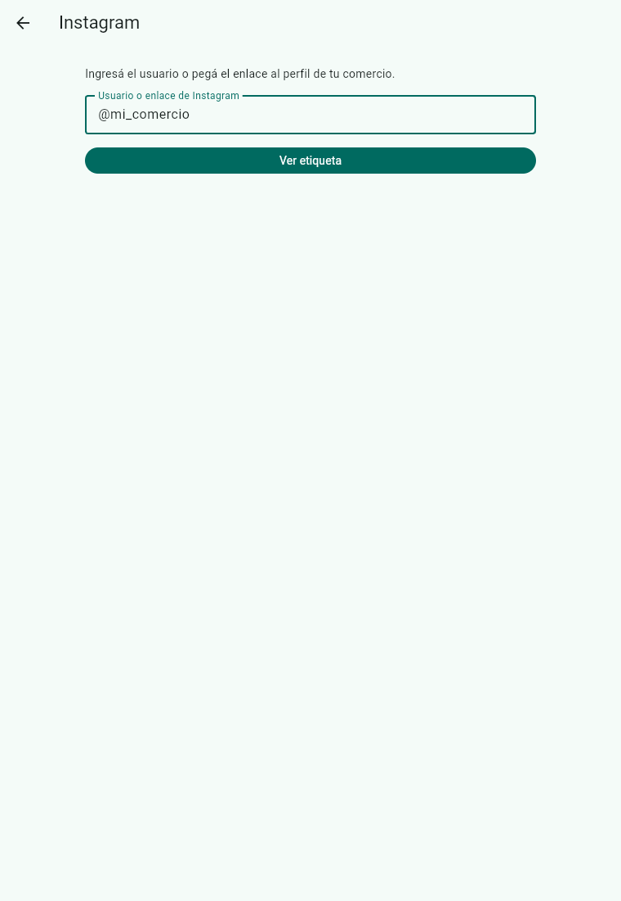
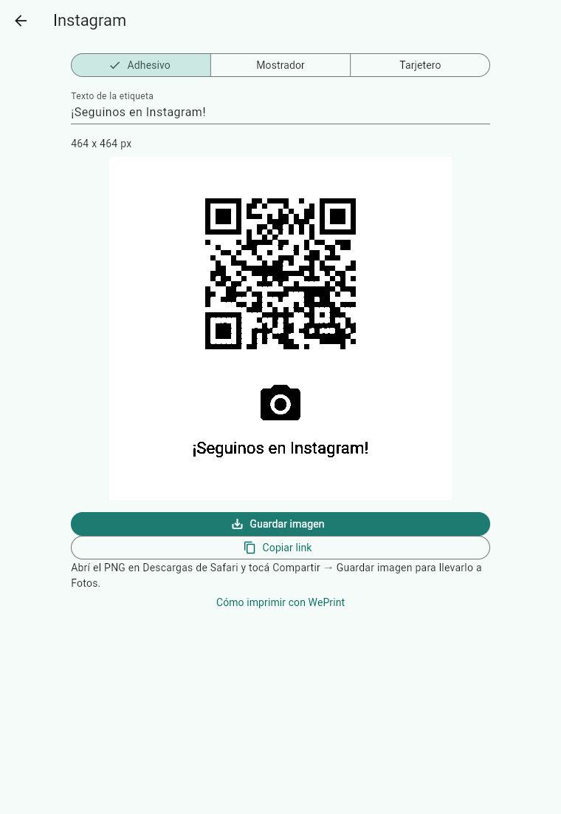
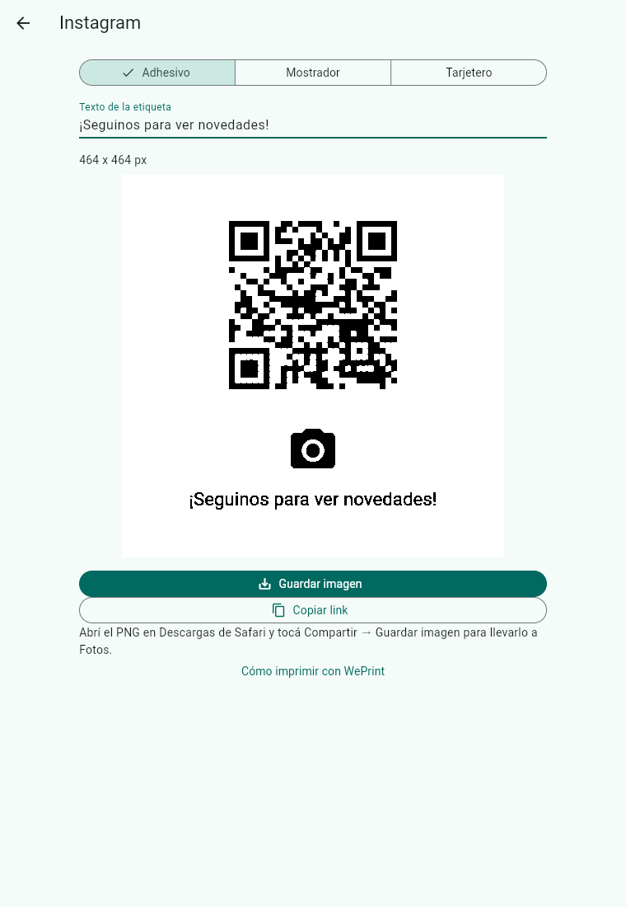

# Verificación del issue #17

Capturas tomadas con Playwright sobre el build web release servido en
http://localhost:8765, en Chromium (760 × 1100).

Para reproducir:

```sh
flutter build web --release
python3 -m http.server 8765 --directory build/web
```

1. Abrí http://localhost:8765 y esperá cinco segundos.
2. Entrá a WhatsApp, ingresá `011 15 2345-6789` y el mensaje
   `Hola, quiero consultar`. Tocá **Ver etiqueta**.
3. **Copiar link** debe copiar
   `https://wa.me/5491123456789?text=Hola%2C%20quiero%20consultar`.
   **Guardar imagen** descarga el PNG.
4. Volvé al inicio, entrá a Instagram e ingresá `@mi_comercio`.
   Tocá **Ver etiqueta**. El link copiado debe ser
   `https://instagram.com/mi_comercio`. Guardá el PNG.
5. Cambiá entre Adhesivo, Mostrador y Tarjetero y editá el texto.
6. Google Reseñas y Mercado Pago deben mostrar **Próximamente**.

Playwright verificó ambos links leyendo el portapapeles y guardó las descargas:
[WhatsApp](whatsapp-descarga.png) e [Instagram](instagram-descarga.png).
También recorrió las tres variantes, la edición del texto y las dos pantallas
Próximamente. Los widget tests comparan los módulos del QR impreso con la matriz
de la URL esperada, con WhatsApp sin/con mensaje e Instagram con usuario/link.

## Capturas










No se verificó la impresión física ni la hoja de compartir de Safari en iPhone.
