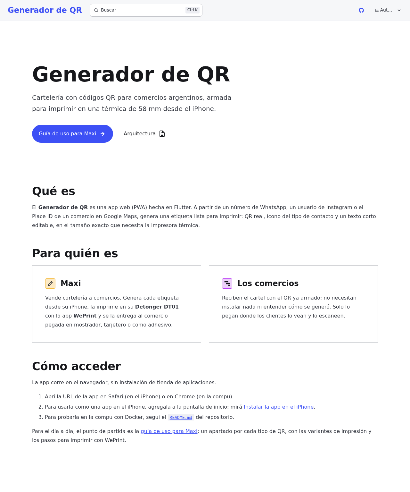
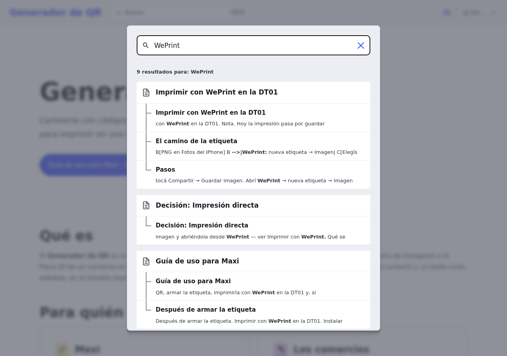
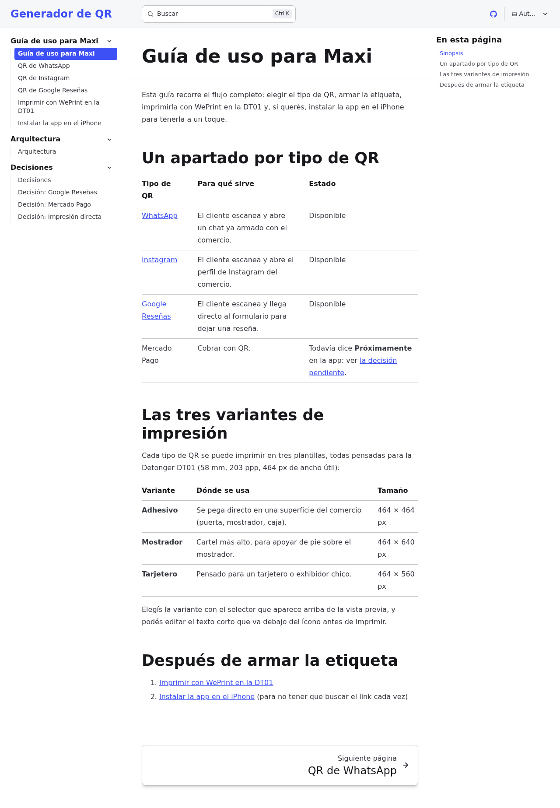
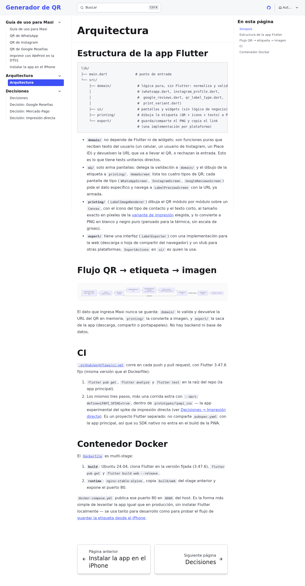
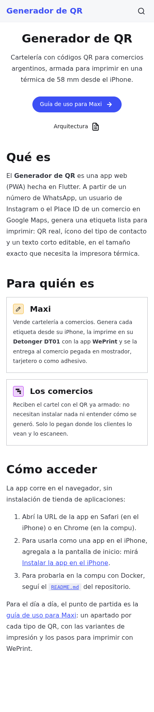
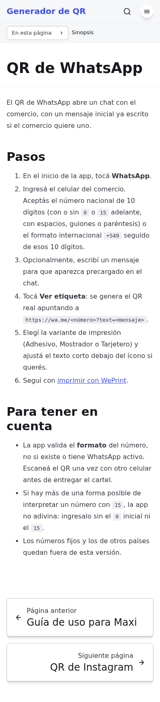
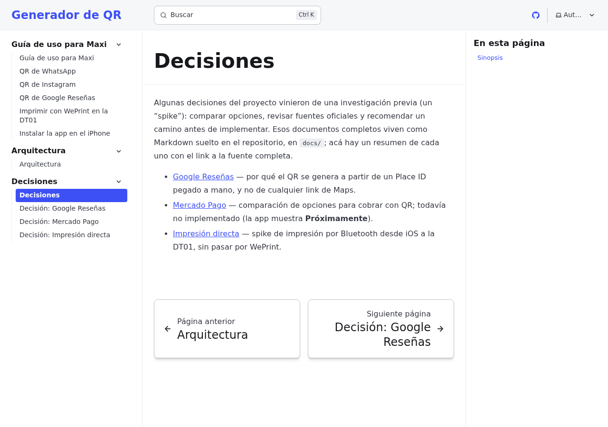

# Verificación del issue #21

Capturas tomadas con Playwright sobre el build de producción del sitio
Starlight (`npm run build && npm run preview`), servido en
`http://127.0.0.1:4321/qr-generator/`.

Para reproducir:

```sh
cd docs
npm install
npm run build
npm run preview
```

1. Abrí `http://127.0.0.1:4321/qr-generator/`: Inicio, con el hero, "Qué es",
   "Para quién es" y "Cómo acceder".
2. Tocá **Buscar** (o `Ctrl K`) y escribí `WePrint`: la búsqueda indexa el
   contenido en español y muestra resultados de varias páginas.
3. Entrá a **Guía de uso para Maxi**: tabla de tipos de QR, variantes de
   impresión y los próximos pasos.
4. Entrá a **Arquitectura**: estructura de `lib/`, el diagrama Mermaid del
   flujo QR → etiqueta → imagen ya renderizado, CI y contenedor Docker.
5. Entrá a **Decisiones**: resumen con links a los documentos originales en
   `docs/`.
6. Repetí Inicio y "QR de WhatsApp" en un viewport de celular (390 × 844):
   sidebar colapsado en menú hamburguesa, texto e índice "En esta página"
   legibles sin zoom.

## Capturas









No se verificó el deploy real en GitHub Pages (requiere el merge a `main`).
