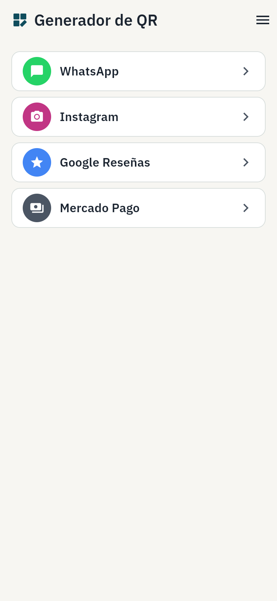
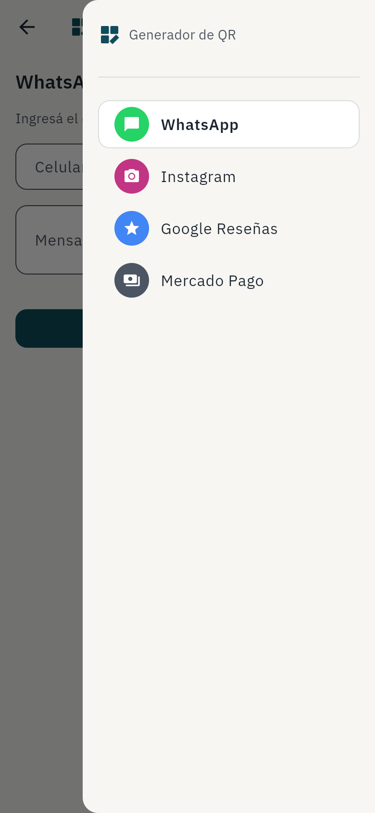
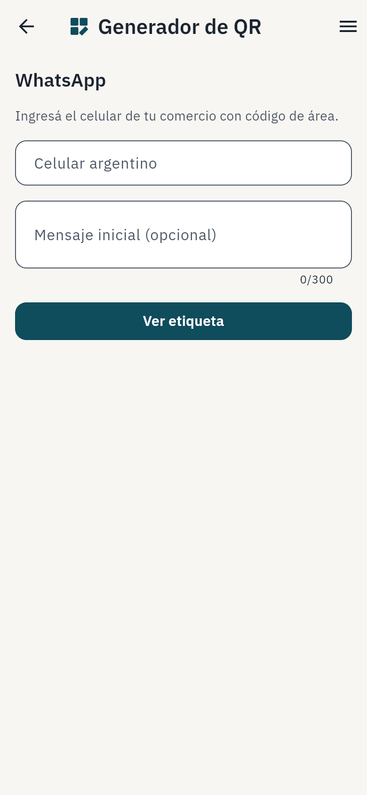
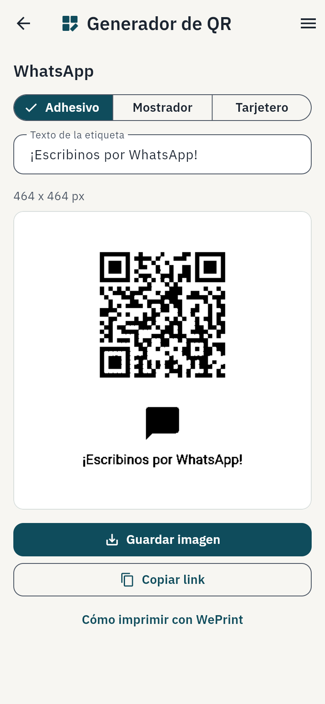
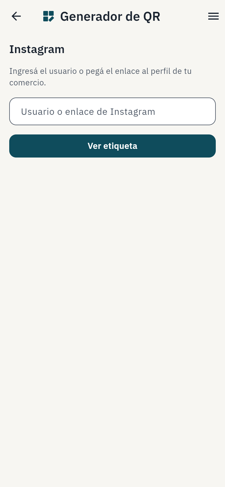
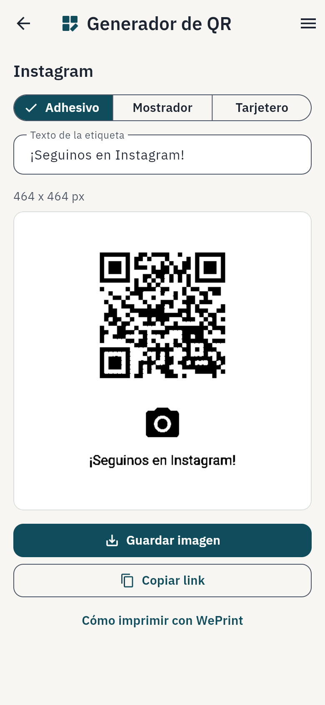
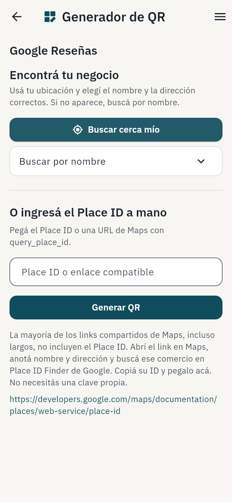
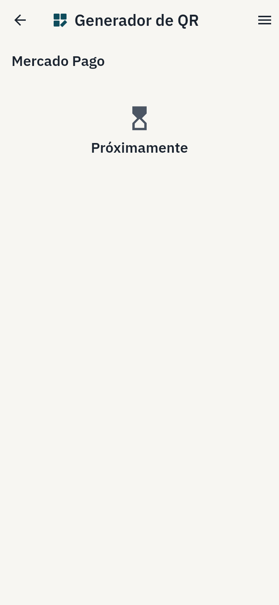
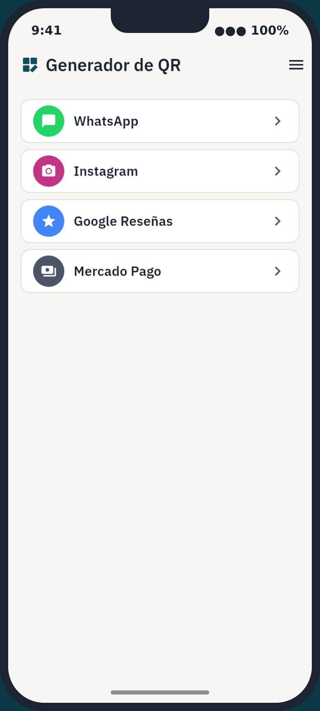

# Issue #29 — Estructura de app: cabecera, menú, pantalla de carga e instalación

Evidencia de la estructura de "app de celular" que pedía el issue (depende
de #28, ya cerrado): cabecera de marca, menú de navegación entre tipos de
QR, pantalla de carga nativa y repaso de instalación en el iPhone.

## Qué cambió

- **Cabecera (`AppScreen`, `AppBrandTitle`):** el `AppBar` de toda pantalla
  muestra siempre el logo + "Generador de QR" (antes cada pantalla mostraba
  su propio nombre — "WhatsApp", "Instagram" — ahí). El botón "Atrás" lo
  sigue agregando Flutter automáticamente cuando hay una pantalla anterior
  en el stack (comportamiento nativo del `Scaffold`, no se tocó). El nombre
  de la sección (ej. "WhatsApp") pasó a mostrarse como encabezado dentro del
  cuerpo (`AppScreen.screenTitle`).
- **Logo en Dart (`AppLogo`/`AppLogoPainter`):** redibuja la geometría de
  `assets/branding/logo.svg` con un `CustomPainter`, sin agregar una
  dependencia de SVG ni un asset rasterizado nuevo.
- **Menú lateral (`AppDrawer`, `endDrawer`):** lista los cuatro tipos de QR
  con el mismo ícono/acento de color que Inicio, resalta el tipo actual y,
  al elegir uno, reemplaza el stack de navegación hasta Inicio antes de
  abrirlo — así "Atrás" siempre vuelve a Inicio sin importar desde qué
  pantalla se abrió el menú. Se abre desde un botón de menú (`Icons.menu`)
  presente en la cabecera de **todas** las pantallas, no sólo en Inicio.
- **Pantalla de carga (`web/index.html`):** antes la app mostraba blanco
  liso mientras Flutter arrancaba. Ahora hay un splash HTML/CSS (fuera del
  árbol de Flutter, porque corre antes de que el motor pinte algo) con el
  logo sobre fondo Papel y una animación de pulso; se desvanece con un fade
  al recibir el evento `flutter-first-frame` del engine.
- **Instalación en iPhone:** se agregó el meta tag
  `apple-mobile-web-app-capable` que faltaba (Safari lo sigue pidiendo para
  abrir a pantalla completa además del `mobile-web-app-capable` más nuevo);
  `apple-mobile-web-app-status-bar-style`, `apple-mobile-web-app-title` y el
  `manifest.json` (`display: standalone`, íconos) ya estaban resueltos por
  el #28 y se revisaron sin cambios.

## Por qué este patrón de menú (justificación)

Se eligió un **menú lateral (`Drawer`)** en vez de una barra inferior:

- Maxi usa la app a una mano, parada en el mostrador — un ícono de menú
  arriba a la derecha es alcanzable con el pulgar igual que una barra
  inferior, pero no le quita alto útil a la vista previa de la etiqueta
  (`LabelPreviewScreen`), que ya es la pantalla más alta de la app y es
  literalmente WYSIWYG del cartel impreso: recortarla con una barra fija
  abajo iba en contra de ese principio.
- Son 4 tipos de QR hoy y "los que se sumen" después (dice el issue): una
  barra inferior con ítems fijos no escala bien más allá de 4-5 sin
  agregar un ítem "Más…" que termina siendo, en los hechos, el mismo menú
  lateral con un paso extra.
- El patrón reaprovecha la lista de Inicio tal cual (mismo ícono/acento de
  color por tipo, ya resuelto en el #26): el menú es la misma información,
  disponible desde cualquier pantalla, no una jerarquía nueva que aprender.

## Qué aportó cada skill

**`frontend-design`:** la cabecera y el menú reusan los tokens ya definidos
en el #26 (Sello, Papel, Superficie, Borde, radios de 12px, sin sombras) sin
agregar ninguno nuevo — el criterio aplicado fue de *extensión*, no de
diseño desde cero: el ítem resaltado del menú usa el mismo tratamiento que
una `Card` (fondo Superficie + borde Borde) en vez de inventar un color de
selección, y el splash reutiliza Papel/Sello en vez de un color de carga
genérico.

**`impeccable`:** se repasó `component-review.md` y `craft.md` para la
cabecera/menú nuevos: confirmó que un segundo nivel de título (marca fija +
headline de sección) es preferible a competir por el mismo espacio del
`AppBar`, y que el estado "seleccionado" del menú debía resolverse con los
tokens existentes (ver arriba) en vez de con el azul de selección por
defecto de Material, que hubiera roto la regla de "un solo acento" del
`DESIGN.md`. El detector automático sigue sin aplicar a esta app (Flutter
web con CanvasKit pinta todo en un `<canvas>`; ver `docs/issue-26/README.md`
para el detalle ya documentado de por qué).

## Cómo se probó

- `flutter analyze` sin errores ni warnings, `flutter test` en verde (100
  tests, incluye los nuevos `app_logo_test.dart`, `app_screen_test.dart`,
  `app_drawer_test.dart` y `web_shell_test.dart`).
- Recorrido manual con Playwright (Chromium del sistema, sin Playwright
  instalado previamente en el repo — se instaló sólo en este entorno vía
  `pip install playwright`, no se agregó como dependencia del proyecto) en
  viewport de celular (390×844): splash → Inicio → cada flujo (WhatsApp,
  Instagram, Google Reseñas, Mercado Pago) → menú abierto desde distintas
  pantallas → "Atrás" vuelve a Inicio.
- Los tests existentes de `AGENTS.md` (WhatsApp e Instagram de punta a
  punta, con verificación de los píxeles reales del QR impreso) siguen
  pasando sin cambios en `lib/src/domain/`, `lib/src/printing/` ni
  `lib/src/export/` — la etiqueta impresa no se tocó.
- Instalación en iPhone real: **no verificado en dispositivo** (sin acceso
  a un iPhone/Safari en este entorno autónomo). Se revisaron los meta tags
  y el `manifest.json` contra la documentación de Apple/PWA y se cubrieron
  con `test/web_shell_test.dart`; la captura `10-standalone-simulado.png`
  es una composición (captura real de la app enmarcada en un simulacro de
  iPhone, mismo criterio que `docs/issue-28/iphone-simulation.png`), no una
  captura de un dispositivo real.

## Capturas (viewport 390×844)












## Cómo reproducir

```sh
flutter build web --release
python3 -m http.server 8765 --directory build/web
```

Abrí `http://localhost:8765` en un viewport de celular y esperá a que el
splash se desvanezca. Para ver la semántica (textos/roles ARIA) con
Playwright, hacé click en el `<flt-semantics-placeholder>` invisible antes
de interactuar, igual que en `docs/issue-26/README.md`.
