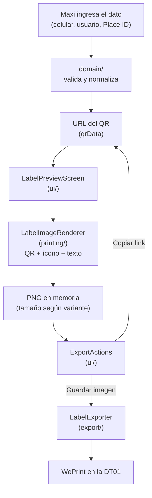

## Estructura de la app Flutter

```
lib/
├── main.dart              # punto de entrada
└── src/
    ├── domain/             # lógica pura, sin Flutter: normaliza y valida
    │                       # (whatsapp.dart, instagram_profile.dart,
    │                       #  google_reviews.dart, qr_label_type.dart,
    │                       #  print_variant.dart)
    ├── ui/                 # pantallas y widgets (sin lógica de negocio)
    ├── printing/           # dibuja la etiqueta (QR + ícono + texto) a PNG
    └── export/             # guarda/comparte el PNG y copia el link
                            # (una implementación por plataforma)
```

- **`domain/`** no depende de Flutter ni de widgets: son funciones puras que
  reciben texto del usuario (un celular, un usuario de Instagram, un Place
  ID) y devuelven la URL que va a llevar el QR, o rechazan la entrada. Esto es
  lo que tiene tests unitarios directos.
- **`ui/`** solo arma pantallas: delega la validación a `domain/` y el dibujo
  de la etiqueta a `printing/`. `HomeScreen` lista los cuatro tipos de QR;
  cada pantalla de tipo (`WhatsAppScreen`, `InstagramScreen`,
  `GoogleReviewsScreen`) pide el dato específico y navega a
  `LabelPreviewScreen` con la URL ya armada.
- **`printing/`** (`LabelImageRenderer`) dibuja el QR módulo por módulo sobre
  un `Canvas`, con el ícono del tipo de contacto y el texto corto, al tamaño
  exacto en píxeles de la [variante de impresión](/qr-generator/guia-de-uso/#las-tres-variantes-de-impresión)
  elegida, y lo convierte a PNG en blanco y negro puro (pensado para la
  térmica, sin escala de grises).
- **`export/`** tiene una interfaz (`LabelExporter`) con una implementación
  para la web (descarga o hoja de compartir del navegador) y un stub para
  otras plataformas; `ExportActions` en `ui/` es quien la usa.

## Flujo QR → etiqueta → imagen



El dato que ingresa Maxi nunca se guarda: `domain/` lo valida y devuelve la
URL del QR en memoria, `printing/` la convierte a imagen, y `export/` la saca
de la app (descarga, compartir o portapapeles). No hay backend ni base de
datos.

## CI

[`.github/workflows/ci.yml`](https://github.com/maxiar-org/qr-generator/blob/main/.github/workflows/ci.yml)
corre en cada push y pull request, con Flutter 3.47.6 fijo (misma versión que
el Dockerfile):

1. `flutter pub get`, `flutter analyze` y `flutter test` en la raíz del repo
   (la app principal).
2. Los mismos tres pasos, más una corrida extra con
   `--dart-define=LPAPI_SPIKE=true`, dentro de `prototypes/lpapi_ios` — la app
   experimental del spike de impresión directa (ver
   [Decisiones → Impresión directa](/qr-generator/decisiones/impresion-directa/)).
   Es un proyecto Flutter separado: no comparte `pubspec.yaml` con la app
   principal, así que su SDK nativo no entra en el build de la PWA.

## Contenedor Docker

El [`Dockerfile`](https://github.com/maxiar-org/qr-generator/blob/main/Dockerfile)
es multi-stage:

1. **`build`**: Ubuntu 24.04, clona Flutter en la versión fijada (3.47.6),
   `flutter pub get` y `flutter build web --release`.
2. **`runtime`**: `nginx:stable-alpine`, copia `build/web` del stage anterior
   y expone el puerto 80.

`docker-compose.yml` publica ese puerto 80 en `8080` del host. Es la forma
más simple de levantar la app igual que en producción, sin instalar Flutter
localmente — se usa tanto para desarrollo como para probar el flujo de
[guardar la etiqueta desde el iPhone](/qr-generator/guia-de-uso/imprimir-con-weprint/).
