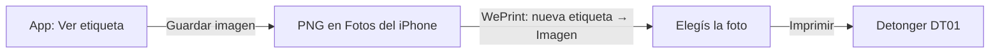

:::note
Hoy la impresión pasa por **guardar la imagen y abrirla desde WePrint**. No hay
impresión directa por Bluetooth desde la app todavía — ver el spike en
[Decisiones → Impresión directa](/qr-generator/decisiones/impresion-directa/).
:::

## El camino de la etiqueta

## Pasos

1. Con la etiqueta en pantalla, tocá **Guardar imagen**.
   - En HTTPS, se abre la hoja de compartir: elegí **Guardar imagen** para
     llevarla directo a Fotos.
   - Si el navegador descarga el PNG en vez de ofrecer compartir, abrilo desde
     **Descargas** de Safari y tocá **Compartir → Guardar imagen**.
2. Abrí **WePrint** → **nueva etiqueta** → **Imagen** → elegí la foto que
   acabás de guardar.
3. Revisá la vista previa en WePrint y tocá **Imprimir**.

Estos mismos pasos están siempre a mano desde el botón **Cómo imprimir con
WePrint** que aparece debajo de la etiqueta en la app.

## Antes de imprimir, revisá

- Que la DT01 tenga papel cargado y esté encendida.
- Que elegiste la variante correcta (Adhesivo, Mostrador o Tarjetero): cada
  una tiene un tamaño distinto pensado para dónde se va a pegar.
- Que el texto corto debajo del ícono esté bien escrito — se puede editar
  antes de guardar la imagen.

## Si no tenés HTTPS a mano

Guardar imagen con hoja de compartir requiere un contexto seguro (HTTPS) en
Safari. Probando en la red local por HTTP, la app descarga el PNG igual, solo
que sin la hoja de compartir — seguí con el paso 1 (descarga) de arriba. Más
detalle sobre cómo exponer la app por HTTPS para probar en el
[`README.md` del repositorio](https://github.com/maxiar-org/qr-generator#hoja-de-compartir-directamente-desde-la-app).
